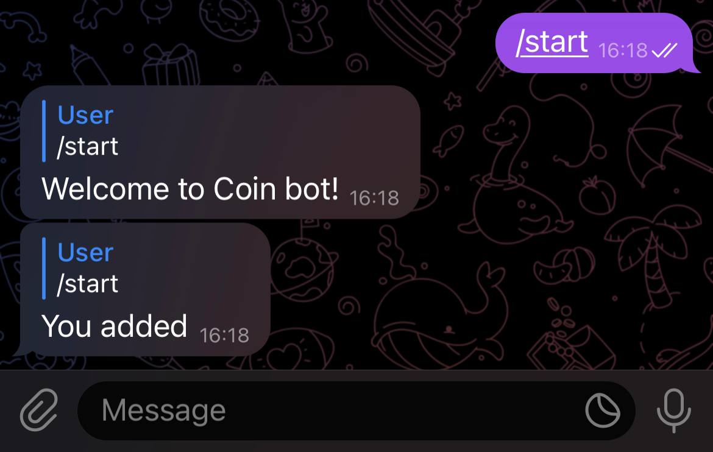
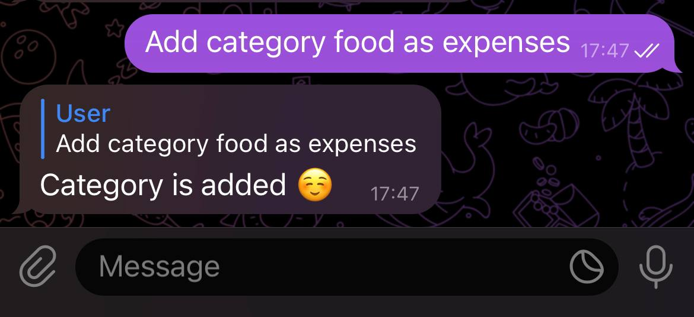

# coin_keeper_bot
Telegram bot that allows you to control your expenses and incomes


Installation and Setup

1. Clone the repository:
```bash
git clone https://github.com/andrewvect/coin_keeper_bot
```
2. Create token in telegram with @botfather

3. Add in file app/config.py configuration settings<br />
   SECRET_KEY <br />
   SQLALCHEMY_DATABASE_URI <br />
   token 

5. Build doker container with command
```bash
docker build -t coin_bot:tag -f Dockerfile.prod .
```
4. Run docker
```bash
docker run -p 5000:5000 coin_bot
```
5. Now your bot can get telegram updates with webhook on
```bash
http://localhost:5000/webhook/  
```

How to use it

Find your bot in telgram, press button start



1. First you need to create category



3. Second you need to add subcategory in your created category


3. That's it. Now you can add values in your created subcategory

